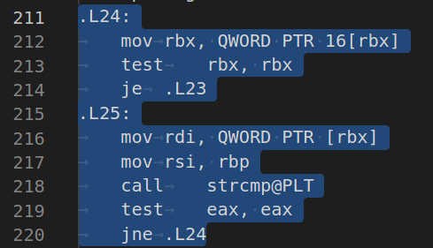

### __This is the 6th lab in ded32's 2nd-semester course__

### ___The tasks:___
* Implement chained hash table.
* Test different hash functions values uniformity to choose the best one for the next task.
* Optimize element search function.  

### ___Hash Table implementation:___

My hash table unoptimized code is here:
https://github.com/VasiliyMatr/ASM/blob/master/T06HASH/unoptimized

I have used a word set to test my hash table, you can find it here:
https://github.com/VasiliyMatr/ASM/blob/master/T06HASH/data/word_set.txt

Also, hash table size were specially chosen too tiny for the test word set. It has helped to find badly optimized code later.

### ___Hash functions tests:___

I've tested six hash functions:
* One value hash func - returns 0 in all cases
* First letter hash func - returns first letter code
* Letters sum hash func - returns all letters codes sum
* Letters avg hash func - returns all letters codes avg value
* My hash func used in 3rd lab of ded32's 1st-semester course
* Crc32 hash func

Here are the results:

   |  
---------------------------|------------------------------

 | 
-----------------------------|------------------------------

  | 
----------------------|------------------------------

I decided to use crc32 for the next task, but I would like to note that my hash function showed pretty good results too.

### ___Optimization:___

I will compare 2 programs, compiled with the g++ -O2 option: unoptimized and optimized versions (hash and oHash).
I used Callgrind utility to profile my program and time utility to compare execution times of optimized and unoptimized versions.

Here are the first time test results:


Here are the first profile results:


As you can see, the crc32 hash function has used ~96% of all execution time.

I've used _mm_crc32_u8 function to optimize crc32 hash function code.

Were:
```c++

HashTableKey_t crc32Hash( HashableData_t hashableData )
{
  /* Not initing data for speed */
    unsigned int crc32Table[256];
    unsigned int crc32Hash;
    int i, j;

    int len = strlen (hashableData);

    for (i = 0; i < 256; i++)
    {
        crc32Hash = i;
        for (j = 0; j < 8; j++)
            crc32Hash = crc32Hash & 1 ? (crc32Hash >> 1) ^ 0xEDB88320UL : crc32Hash >> 1;

        crc32Table[i] = crc32Hash;
    };

    crc32Hash = 0xFFFFFFFFUL;

    while (len--)
        crc32Hash = crc32Table[(crc32Hash ^ *hashableData++) & 0xFF] ^ (crc32Hash >> 8);

    return crc32Hash ^ 0xFFFFFFFFUL;
}

```

With _mm_crc32_u8 usage:

```c++

HashTableKey_t crc32Hash( HashableData_t hashableData )
{
    int            symbolId = 0;
    char           symbol   = hashableData[0];
    HashTableKey_t hash     = 0xFFFFFFFF;

    for (; symbol != '\0'; symbol = hashableData[++symbolId])
        hash = _mm_crc32_u8 (hash, symbol);

    return hash;
}

```

And you can see dramatic optimization result:

Were:


Now:


Works ~ 9.9 times faster now

Then we are profiling again:


As you can see, the List class getter for left/right pointer is using  ~25% of all execution time.
I've simply changed this place in the hash table get function:

```c++

    elemP = listP->getPrevOrNext (elemP, List::ListElemSide_t::NEXT_);

```

To this:

```c++

    elemP = elemP->nextP_;

```

And performance became a bit better:

Were:


Now:


Works ~ 1.3 times faster now

Then I've profiled my hash table again:


As you can see, we need to optimize the strcmp function. I've refactored the hash table for fast comparations & written my strcmp function.

Cmp function code:
```c++

int fastStrCmp( const HashableData_t& str1, const HashableData_t& str2 )
{
    static const int mask = _SIDD_UBYTE_OPS | _SIDD_CMP_EQUAL_EACH;

    __m128i str1Part = _mm_set_epi64x (*(long long*)str1, *((long long*)str1 + 1));
    __m128i str2Part = _mm_set_epi64x (*(long long*)str2, *((long long*)str2 + 1));

    str1Part = _mm_cmpeq_epi64 (str1Part, str2Part);
    register size_t result = _mm_movemask_epi8 (str1Part);

    if (result != 0xffff)
        return 1;

    str1Part = _mm_set_epi64x (*((long long*)str1 + 2), *((long long*)str1 + 3));
    str2Part = _mm_set_epi64x (*((long long*)str2 + 2), *((long long*)str2 + 3));

    str1Part = _mm_cmpeq_epi64 (str1Part, str2Part);
    return _mm_movemask_epi8 (str1Part) != 0xffff;
}

```

Also, check the refactor branch final commit for details.

And here is the result:

Were:


Now:


Works ~ 1.5 times faster now

Then I've checked profile info for last time:


As we can see, all slowest funcs are optimized now, the only place, that can be optimized is that cycle:

```c++

    while (elemP != nullptr)
    {
        if (!fastStrCmp (elemP->listElemData_.hashableData_, data2Seek))
            return elemP->listElemData_;

        elemP = elemP->nextP_;
    }

```

But I've checked ASM code, that g++ generates for this while:



And this ASM code is quite optimized. So I decided to stop with optimizations.

### ___Final comparison:___


### ___Test programm is working ~20 times faster now.___​
2
### __This is the 6th lab in ded32's 2nd semester course__
3
​
4
### ___The tasks:___
5
* Implement chained hash table.
6
* Test different hash functions values uniformity to choose the best one for next task.
7
* Optimize element search function.  
8
​
9
### ___Hash Table implementation:___
10
​
11
My hash table unoptimized code is here:
12
https://github.com/VasiliyMatr/ASM/blob/master/T06HASH/unoptimized
13
​
14
I have used word set to test my hash table, you can find it here:
15
https://github.com/VasiliyMatr/ASM/blob/master/T06HASH/data/word_set.txt
16
​
17
Also, hash table size were specially choosed too tiny for test word set. It has helped to find bad optimized code later.
18
​
19
### ___Hash functions tests:___
20
​
21
I've tested six hash functions:
22
* One value hash func - returns 0 in all cases
23
* First letter hash func - returns first letter code
24
* Letters sum hash func - returns all letters codes sum
25
* Letters avg hash func - returns all letters codes avg value
26
* My hash func used in 3rd lab of ded32's 1st semester course
27
* Crc32 hash func
28
​
29
Here are the results:
30
​
31
   |  
32
---------------------------|------------------------------
33
​
34
 | 
35
-----------------------------|------------------------------
36
​
37
  | 
38
----------------------|------------------------------
39
​
40
I decided to use crc32 for next task, but i would like to note that my hash function showed pretty good results to.
41
​
42
### ___Optimization:___
43
​
44
I will compare 2 programs, compiled with g++ -O2 option: unoptimized and optimized versions (hash and oHash).
45
I used callgrind utility to profile my program and time utility to compare execution times of optimized and unoptimized versions.
46
​
47
Here is the first time test results:
48
​
49

50
​
51
Here is the first profile retults:
52
​
53

54
​
55
As you can see, crc32 hash function has used ~96% of all execution time.
56
​
57
I've used _mm_crc32_u8 function to optimize crc32 hash function code.
58
​
59
Were:
60
```c++
61
​
62
HashTableKey_t crc32Hash( HashableData_t hashableData )
63
{
64
  /* Not initing data for speed */
65
    unsigned int crc32Table[256];
66
    unsigned int crc32Hash;
67
    int i, j;
68
​
69
    int len = strlen (hashableData);
70
​
71
    for (i = 0; i < 256; i++)
72
    {
73
        crc32Hash = i;
74
        for (j = 0; j < 8; j++)
