# __This is the 6th lab in ded32's 2nd-semester course__

## ___The tasks:___
* Implement chained hash table.
* Test different hash functions values uniformity to choose the best one for the next task.
* Optimize element search function.  

## ___Hash Table implementation:___

My hash table unoptimized code is here:
>https://github.com/VasiliyMatr/ASM/blob/master/T06HASH/unoptimized

I have used a word set to test my hash table, you can find it here:
>https://github.com/VasiliyMatr/ASM/blob/master/T06HASH/data/word_set.txt

Also, hash table size were specially chosen too tiny for the test word set. It has helped to find badly optimized code later.

## ___Hash functions tests:___

### I've tested six hash functions:
* One value hash func - returns 0 in all cases
* First letter hash func - returns first letter code
* Letters sum hash func - returns all letters codes sum
* Letters avg hash func - returns all letters codes avg value
* My hash func used in 3rd lab of ded32's 1st-term course
* Crc32 hash func

### Here are the results: <br/>
>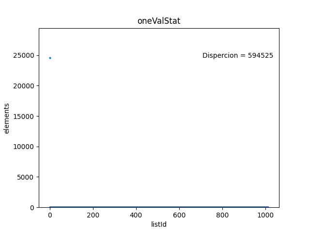 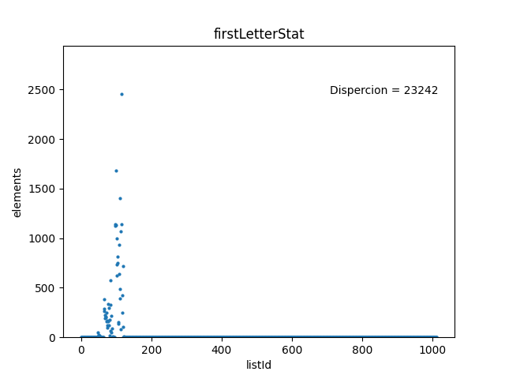 
>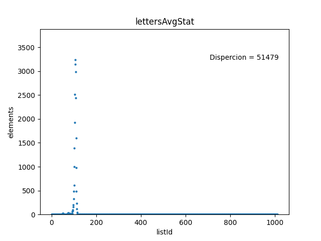 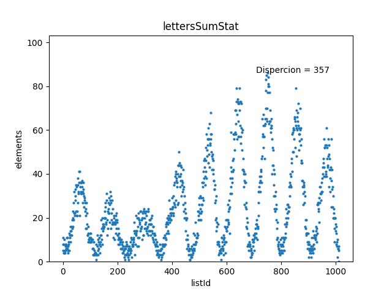 
>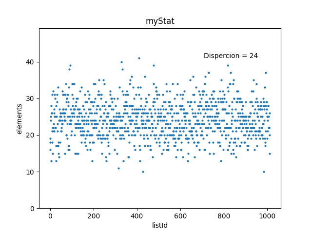 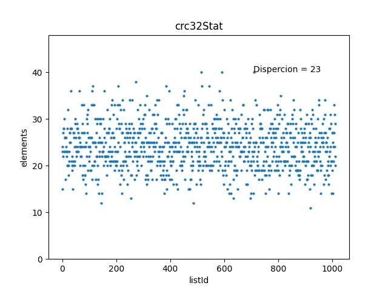 

#### _I decided to use crc32 for the next task, but I would like to note that my hash function showed pretty good results too._

## ___Optimization:___

I will compare 2 programs, both compiled with the `g++ -O2` compilation flag: unoptimized and optimized versions.
I've used `Callgrind` utility to profile my program and `time` utility to compare execution times of optimized and unoptimized versions.

I've copied functions realization in an optimized folder:
>https://github.com/VasiliyMatr/ASM/tree/refactor/T06HASH/optimized.

Here are the first time tests results (`hash` - unoptimized; `oHash` - optimized):<br/>
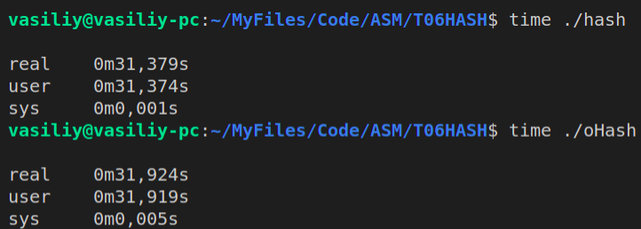

We can see that all works correctly and I can optimize my code and easily test performance improvements now.<br/>
Let's profile the test program with Callgrind.

### Here are the first profile results:<br/>
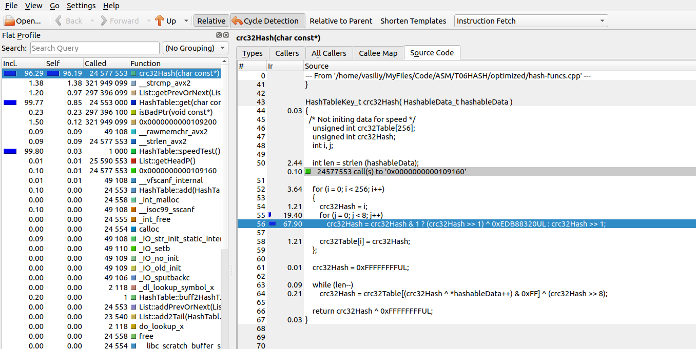

As you can see, the crc32 hash function has used ___~96%___ of all execution time.

I've used _mm_crc32_u8 function to optimize crc32 hash.

Old crc32Hash code:
```c++

HashTableKey_t crc32Hash( HashableData_t hashableData )
{
  /* Not initing data for speed */
    static unsigned int crc32Table[256] = { 1 };
    unsigned int crc32Hash = 0;

    int len = strlen (hashableData);

    if (crc32Table [0] == 1)
        for (int i = 0; i < 256; i++)
        {
            crc32Hash = i;
            for (int j = 0; j < 8; j++)
                crc32Hash = crc32Hash & 1 ? (crc32Hash >> 1) ^ 0xEDB88320UL : crc32Hash >> 1;

            crc32Table[i] = crc32Hash;
        };

    crc32Hash = 0xFFFFFFFFUL;

    while (len--)
        crc32Hash = crc32Table[(crc32Hash ^ *hashableData++) & 0xFF] ^ (crc32Hash >> 8);

    return crc32Hash ^ 0xFFFFFFFFUL;
}

```

With _mm_crc32_u8 usage:

```c++

HashTableKey_t crc32Hash( HashableData_t hashableData )
{
    int            symbolId = 0;
    char           symbol   = hashableData[0];
    HashTableKey_t hash     = 0xFFFFFFFF;

    for (; symbol != '\0'; symbol = hashableData[++symbolId])
        hash = _mm_crc32_u8 (hash, symbol);

    return hash;
}

```

### And you can see dramatic optimization results:

Were with `g++ -O2` and NO my optimizations:<br/>
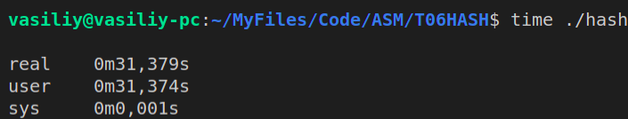

Now with `g++ -O2` and my Crc32 hash:<br/>
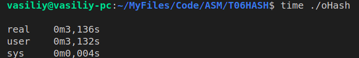

#### Code works ~ ___9.9___ times faster after Crc32 optimization.

### Then we are profiling again:<br/>
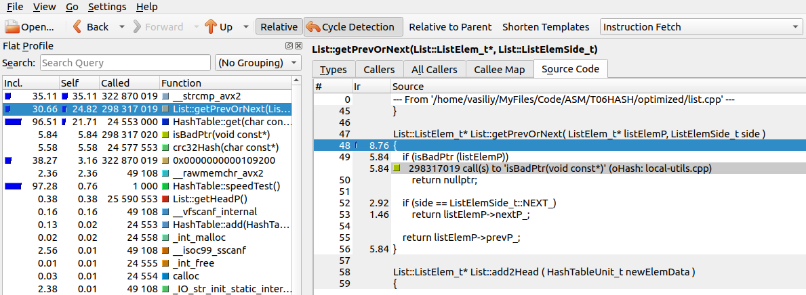

As you can see, the List class getter for left/right pointer is using  ___~25%___ of all execution time.

I've simply changed this line in the hash table get function:

```c++

    elemP = listP->getPrevOrNext (elemP, List::ListElemSide_t::NEXT_);

```

To this line:

```c++

    elemP = elemP->nextP_;

```

### And performance became a bit better:

Were with `g++ -O2` and only my Crc32 hash:<br/>


Now with `g++ -O2`, my Crc32 hash and next/prev getter inline:<br/>
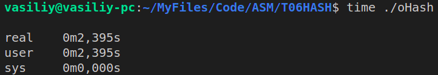

#### Works ___~1.3___ times faster now.

### Then I've profiled my hash table again:<br/>
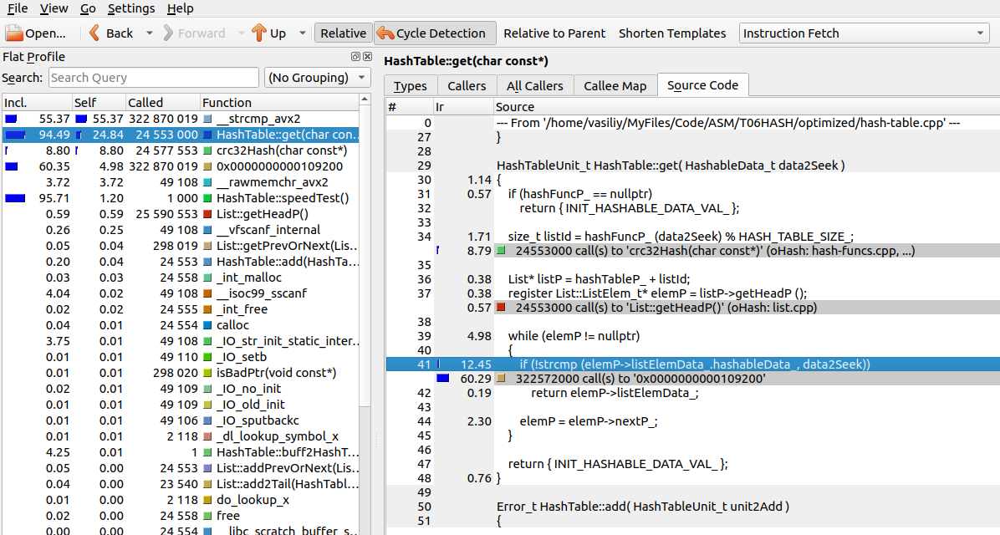

As you can see, we need to optimize the strcmp function.<br/>
I've refactored the hash table for fast comparations & written my strcmp function.

fastStrCmp function code:
```c++

int fastStrCmp( const HashableData_t& str1, const HashableData_t& str2 )
{
    static const int mask = _SIDD_UBYTE_OPS | _SIDD_CMP_EQUAL_EACH;

    __m128i str1Part = _mm_set_epi64x (*(long long*)str1, *((long long*)str1 + 1));
    __m128i str2Part = _mm_set_epi64x (*(long long*)str2, *((long long*)str2 + 1));

    str1Part = _mm_cmpeq_epi64 (str1Part, str2Part);
    register size_t result = _mm_movemask_epi8 (str1Part);

    if (result != 0xffff)
        return 1;

    str1Part = _mm_set_epi64x (*((long long*)str1 + 2), *((long long*)str1 + 3));
    str2Part = _mm_set_epi64x (*((long long*)str2 + 2), *((long long*)str2 + 3));

    str1Part = _mm_cmpeq_epi64 (str1Part, str2Part);
    return _mm_movemask_epi8 (str1Part) != 0xffff;
}

```

Also, check the refactor branch final commit for refactoring details:<br/>
>https://github.com/VasiliyMatr/MIPT_PROG_2ndTERM/edit/refactor/T06HASH/

### And here is the result:

Were with `g++ -O2` and all previous optimizations:<br/>


Now with `g++ -O2`, all previous optimization and fastStrCmp:<br/>
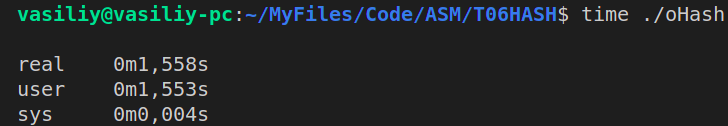

#### Works ___~1.5___ times faster now

Also, I've refactored hash function a bit:

Old version:

```c++

HashTableKey_t crc32Hash( HashableData_t hashableData )
{
    int            symbolId = 0;
    char           symbol   = hashableData[0];
    HashTableKey_t hash     = 0xFFFFFFFF;

    for (; symbol != '\0'; symbol = hashableData[++symbolId])
        hash = _mm_crc32_u8 (hash, symbol);

    return hash;
}

```

New one with less number of calls:

```c++

HashTableKey_t crc32Hash( HashableData_t hashableData )
{
    int            symbolId = 0;
    char           symbol   = hashableData[0];
    HashTableKey_t hash     = 0xFFFFFFFF;

    hash = _mm_crc32_u64 (hash, *(unsigned long long*) hashableData);

    return _mm_crc32_u64 (hash, *(((unsigned long long*) hashableData) + 1));
}

```

### And let's check times again:

Were with `g++ -O2`, all previous optimization and fastStrCmp:<br/>


Now with `g++ -O2`, all previous optimization, fastStrCmp and refactored hash func:<br/>
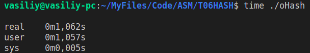

#### Works ___~1.5___ times faster now


### Then I've checked profile info for last time:<br/>
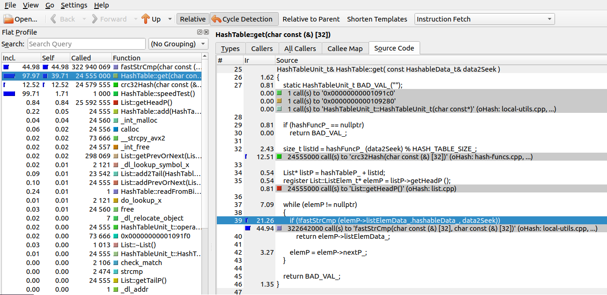

As we can see, all the slowest funcs are optimized now.<br/>
The only place, that can be optimized is that cycle:

```c++

    while (elemP != nullptr)
    {
        if (!fastStrCmp (elemP->listElemData_.hashableData_, data2Seek))
            return elemP->listElemData_;

        elemP = elemP->nextP_;
    }

```

But I've checked ASM code, that `g++` generates for this while with `-O2` option:

```ASM
  ...

.L48:
	mov	rbx, QWORD PTR 40[rbx]
	test	rbx, rbx
	je	.L28
.L30:
	mov	rsi, rbp
	mov	rdi, rbx
	mov	r12, rbx
	call	_Z10fastStrCmpRA32_KcS1_@PLT
.LEHE2:
	test	eax, eax
	jne	.L48
  
  ...
```

And this ASM code is quite optimized. So I decided to stop with optimizations.

## ___Optimization results:___

### Final comparison:<br/>
<br/>


## As you can see, profiling tools are quite useful and can help to easily increase code efficiency. I've changed only about 40 lines (thanks to Intel intrinsics) in my code and it is working ___~30 times___ faster on the test words asset now.
