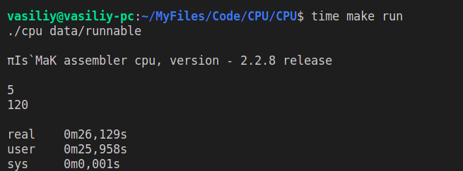
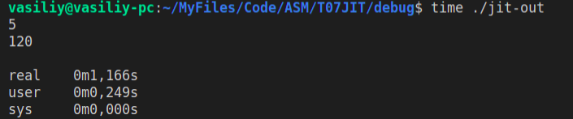

# __T07JIT__

Это последний проект в рамках 2го семестра обучения в группе И.Р. Дединского.

## Задача:

Транслировать файл с исполняемым кодом моего формата в исполняемый файл формата ELF.
Данную задачу можно разбить на 2 (*3) части:
- Создание пустого ELF файла, в который можно добавить транслированный код.
- Трансляция машинного кода моего формата в машинный код формата x86 и запись транслированного кода в ELF файл.
- *Оптимизация машинного кода (в любом из форматов) с целью получить более быстрый результирующий код.

## Создание ELF файла

Я, как прирожденный ~~википедик~~ интернет серфер, воспользовался описаниями ELF файлов с следующего сайта:
>https://ru.wikipedia.org/wiki/Executable_and_Linkable_Format

Так же я написал 3 простых функции на nasm для поддержки такого необходимого функционала, как: ввод; вывод; завершение программы.

И вот, мой ~~ELF~~ ORC файл готов. Ознакомиться с результатом можно здесь:
>https://github.com/VasiliyMatr/MIPT_PROG_2ndTERM/blob/master/T07JIT/debug/headers/elf-header.hpp

## Трансляция
Ну тут нужно просто взять и транслировать... На бинарщину можно посмотреть здесь:
>https://github.com/VasiliyMatr/MIPT_PROG_2ndTERM/blob/master/T07JIT/debug/headers/dsl.hpp ;
>https://github.com/VasiliyMatr/MIPT_PROG_2ndTERM/blob/master/T07JIT/debug/source/dsl.cpp

Также хочеся выразить благодарность компании Intel за little endian. __СПАСИБО, %$#@*&, БОЛЬШОЕ, ОЧЕНЬ УДОБНО.__

## Сравнение времени исполнения

И вот, файл готов, давайте сравним время исполнения на моем эмуляторе CPU и время исполнения транслированного ELF файла:
При запуске на моем эмуляторе CPU:
>
При запуске транслированного ELF файла:
>

Видно, что трансляция позволила получить коллосальный прирост скорости.
Тестовая программа выполняется в ~__100__ раз быстрее. NICE!
